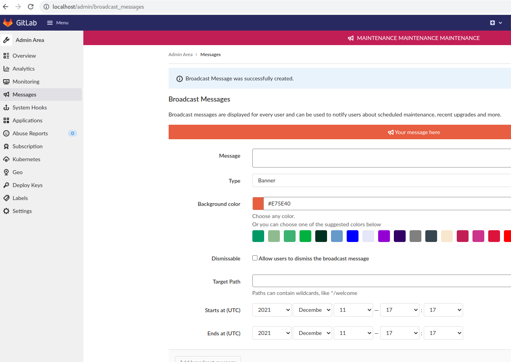
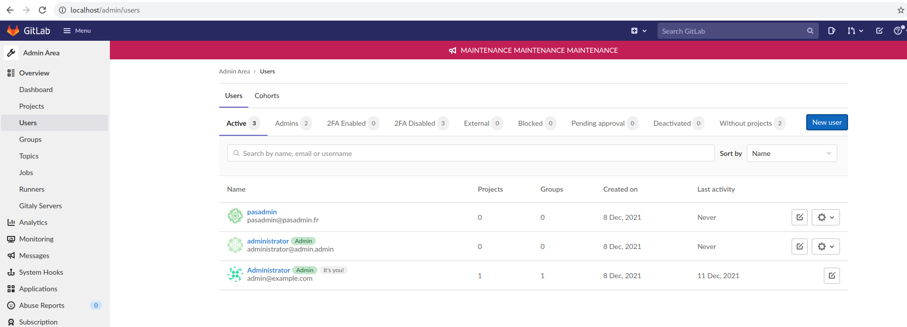

# Administration of Gitlab CE Omnibus

## To Do

- Ajouter un message général pour avertir d’un maintenance 
- Créer 2 utilisateurs (un admin, un standard) 
- Vérifiez le bon fonctionnement du service Gitlab
- Consultez les logs de Nginx 
- Redémarrer le composant Nginx 
- Vérifiez le  status (EN CLI) 
- Redémarrer tout le GitLab (avec systemd ou gitlab-ctl) 
- Exécutez 2 appels  APIs (list groups & create a new group called "My group")
- Créer un backup de Gitlab (et le restaurer)

## Solution

- Ajouter un message général pour avertir d’un maintenance



- Créer 2 utilisateurs (un admin, un standard)



- Vérifiez le bon fonctionnement du service Gitlab

```bash
$ docker exec -it gitlab bash

root@gitlab:/assets# gitlab-ctl status
run: alertmanager: (pid 1482) 1193s; run: log: (pid 1248) 1237s
run: gitaly: (pid 1493) 1192s; run: log: (pid 534) 1323s
run: gitlab-exporter: (pid 1446) 1195s; run: log: (pid 1101) 1255s
run: gitlab-workhorse: (pid 1430) 1195s; run: log: (pid 924) 1268s
run: grafana: (pid 1586) 1192s; run: log: (pid 1393) 1205s
run: logrotate: (pid 475) 1336s; run: log: (pid 483) 1335s
run: nginx: (pid 939) 1264s; run: log: (pid 953) 1263s
run: postgres-exporter: (pid 1503) 1192s; run: log: (pid 1301) 1231s
run: postgresql: (pid 651) 1318s; run: log: (pid 710) 1315s
run: prometheus: (pid 1455) 1194s; run: log: (pid 1219) 1243s
run: puma: (pid 838) 1282s; run: log: (pid 845) 1281s
run: redis: (pid 491) 1330s; run: log: (pid 499) 1329s
run: redis-exporter: (pid 1448) 1194s; run: log: (pid 1186) 1249s
run: sidekiq: (pid 857) 1276s; run: log: (pid 868) 1274s
run: sshd: (pid 35) 1351s; run: log: (pid 34) 1351s
```
- Consultez les logs de Nginx

```bash
$ docker inspect gitlab
...
        "Mounts": [
            {
                "Type": "bind",
                "Source": "/srv/gitlab/config",
                "Destination": "/etc/gitlab",
                "Mode": "",
                "RW": true,
                "Propagation": "rprivate"
            },
            {
                "Type": "bind",
                "Source": "/srv/gitlab/logs",
                "Destination": "/var/log/gitlab",
                "Mode": "",
                "RW": true,
                "Propagation": "rprivate"
            },
...

$ cd /srv/gitlab/logs

$ ls
alertmanager  gitlab-exporter  gitlab-shell      grafana    nginx              postgresql  puma         redis           sidekiq
gitaly        gitlab-rails     gitlab-workhorse  logrotate  postgres-exporter  prometheus  reconfigure  redis-exporter  sshd

$ sudo ls nginx/
access.log  config  current  error.log  gitlab_access.log  gitlab_error.log  lock
```

Or, in the docker container:

```bash
$ docker exec -it gitlab bash
root@gitlab:/# cd /var/log/gitlab/
root@gitlab:/var/log/gitlab# tail -f nginx/*.log
==> nginx/access.log <==

==> nginx/error.log <==

==> nginx/gitlab_access.log <==
127.0.0.1 - - [11/Dec/2021:17:47:58 +0000] "GET /help HTTP/1.1" 200 75380 "" "curl/7.79.1-DEV" -
172.22.0.1 - - [11/Dec/2021:17:48:09 +0000] "POST /-/profile/password HTTP/1.1" 200 20255 "http://localhost/-/profile/password/edit" "Mozilla/5.0 (X11; Linux x86_64) AppleWebKit/537.36 (KHTML, like Gecko) Chrome/96.0.4664.45 Safari/537.36" 4.33
172.22.0.1 - - [11/Dec/2021:17:48:23 +0000] "POST /-/profile/password HTTP/1.1" 302 96 "http://localhost/-/profile/password" "Mozilla/5.0 (X11; Linux x86_64) AppleWebKit/537.36 (KHTML, like Gecko) Chrome/96.0.4664.45 Safari/537.36" -
172.22.0.1 - - [11/Dec/2021:17:48:23 +0000] "GET /users/sign_in HTTP/1.1" 200 9242 "http://localhost/-/profile/password" "Mozilla/5.0 (X11; Linux x86_64) AppleWebKit/537.36 (KHTML, like Gecko) Chrome/96.0.4664.45 Safari/537.36" 3.17
172.22.0.1 - - [11/Dec/2021:17:48:28 +0000] "POST /users/sign_in HTTP/1.1" 302 83 "http://localhost/users/sign_in" "Mozilla/5.0 (X11; Linux x86_64) AppleWebKit/537.36 (KHTML, like Gecko) Chrome/96.0.4664.45 Safari/537.36" -
172.22.0.1 - - [11/Dec/2021:17:48:28 +0000] "GET / HTTP/1.1" 200 19612 "http://localhost/users/sign_in" "Mozilla/5.0 (X11; Linux x86_64) AppleWebKit/537.36 (KHTML, like Gecko) Chrome/96.0.4664.45 Safari/537.36" 4.25
127.0.0.1 - - [11/Dec/2021:17:48:58 +0000] "GET /help HTTP/1.1" 200 75380 "" "curl/7.79.1-DEV" -
127.0.0.1 - - [11/Dec/2021:17:49:58 +0000] "GET /help HTTP/1.1" 200 75380 "" "curl/7.79.1-DEV" -
127.0.0.1 - - [11/Dec/2021:17:50:58 +0000] "GET /help HTTP/1.1" 200 75380 "" "curl/7.79.1-DEV" -
127.0.0.1 - - [11/Dec/2021:17:51:59 +0000] "GET /help HTTP/1.1" 200 75380 "" "curl/7.79.1-DEV" -

==> nginx/gitlab_error.log <==
```

- Redémarrez le composant nginx

```bash
$ docker exec -it gitlab bash
root@gitlab:/# gitlab-ctl restart nginx
ok: run: nginx: (pid 2269) 0s
root@gitlab:/# gitlab-ctl status nginx
run: nginx: (pid 2269) 11s; run: log: (pid 949) 409s
```

- Vérifiez le status de nginx

```bash
$ docker exec -it gitlab bash
root@gitlab:/# gitlab-ctl status nginx
run: nginx: (pid 2269) 11s; run: log: (pid 949) 409s
```

- Redémarrer tout le GitLab (avec gitlab-ctl et en vérifiant le healthcheck docker au passage) 

```bash
root@gitlab:/# gitlab-ctl stop
ok: down: alertmanager: 0s, normally up
ok: down: gitaly: 1s, normally up
ok: down: gitlab-exporter: 1s, normally up
ok: down: gitlab-workhorse: 0s, normally up
ok: down: grafana: 0s, normally up
ok: down: logrotate: 1s, normally up
ok: down: nginx: 0s, normally up
ok: down: postgres-exporter: 1s, normally up
ok: down: postgresql: 0s, normally up
ok: down: prometheus: 1s, normally up
ok: down: puma: 0s, normally up
ok: down: redis: 0s, normally up
ok: down: redis-exporter: 1s, normally up
ok: down: sidekiq: 0s, normally up
ok: down: sshd: 1s, normally up

# Watch docker ps
Every 2.0s: docker ps                                                                              altair: Sat Dec 11 19:04:45 2021

CONTAINER ID   IMAGE                           COMMAND                  CREATED          STATUS                    PORTS
                                               NAMES
1a1a928c7c42   gitlab/gitlab-ee:latest         "/assets/wrapper"        22 minutes ago   Up 22 minutes (healthy)   0.0.0.0:22->22/t
cp, 0.0.0.0:80->80/tcp, 0.0.0.0:443->443/tcp   gitlab
...
CONTAINER ID   IMAGE                           COMMAND                  CREATED          STATUS                      PORTS
                      NAMES
1a1a928c7c42   gitlab/gitlab-ee:latest         "/assets/wrapper"        32 minutes ago   Up 32 minutes (unhealthy)   0.0.0.0:22->22/tcp, 0.0.0.0:80->80/tcp, 0
.0.0.0:443->443/tcp   gitlab

$ docker inspect --format "{{json .State.Health }}" gitlab | jq
{
  "Status": "healthy",
  "FailingStreak": 4,
  "Log": [
    {
      "Start": "2021-12-11T19:04:01.10634246+01:00",
      "End": "2021-12-11T19:04:01.230961611+01:00",
      "ExitCode": 0,
      "Output": "  % Total    % Received % Xferd  Average Speed   Time    Time     Time  Current\n                                 Dload  Upload   Total   Spent    Left  Speed\n\r  0     0    0     0    0     0      0      0 --:--:-- --:--:-- --:--:--     0\r100 75289    0 75289    0     0  1083k      0 --:--:-- --:--:-- --:--:-- 1097k\n<!DOCTYPE html>\n<html class=\"\" lang=\"en\">\n<head prefix=\"og: http://ogp.me/ns#\">\n<meta charset=\"utf-8\">\n<link rel=\"preload\" href=\"/assets/application_utilities-bc027c4ca9c192ebc63aebf7c1217b71b6606d34fa3fdd229f819d180c660dba.css\" as=\"style\" type=\"text/css\">\n<link rel=\"preload\" href=\"/assets/application-1d765038b21c5c76ff8492561c29984f3fa5c4b8cfb3a6c7b216ac8ab18b78c7.css\" as=\"style\" type=\"text/css\">\n<link rel=\"preload\" href=\"/assets/highlight/themes/white-a5a748e3fb932096ef2cc62f8a4c58727c6f0cdd1ae7a28c747f56d74ad27306.css\" as=\"style\" type=\"text/css\">\n\n<meta content=\"IE=edge\" http-equiv=\"X-UA-Compatible\">\n\n<meta content=\"object\" property=\"og:type\">\n<meta content=\"GitLab\" property=\"og:site_name\">\n<meta content=\"Help\" property=\"og:title\">\n<meta content=\"GitLab Enterprise Edition\" property=\"og:description\">\n<meta content=\"http://localhost/assets/gitlab_logo-7ae504fe4f68fdebb3c2034e36621930cd36ea87924c11ff65dbcb8ed50dca58.png\" property=\"og:image\">\n<meta content=\"64\" property=\"og:image:width\">\n<meta content=\"64\" property=\"og:image:height\">\n<meta content=\"http://localhost/help\" property=\"og:url\">\n<meta content=\"summary\" property=\"twitter:card\">\n<meta content=\"Help\" property=\"twitter:title\">\n<meta content=\"GitLab Enterprise Edition\" property=\"twitter:description\">\npng\" />\n<png\" />\n<png\" />\n<style>\n@keyframes blinking-dot{0%{opacity:1}25%{opacity:0.4}75%{opacity:0.4}100%{opacity:1}}@keyframes blinking-scroll-button{0%{opacity:0.2}50%{opacity:1}100%{opacity:0.2}}@keyframes gl-spinner-rotate{0%{transform:rotate(0)}100%{transform:rotate(360deg)}}body.ui-indigo .navbar-gitlab{background-color:#292961}body.ui-indigo .navbar-gitlab .navbar-collapse{color:#d1d1f0}body.ui-indigo .navbar-gitlab .container-fluid .navbar-toggler{border-left:1px solid #6868b9;color:#d1d1f0}body.ui-indigo .navbar-gitlab .navbar-sub-nav>li>a:hover,body.ui-indigo .navbar-gitlab .navbar-sub-nav>li>a:focus,body.ui-indigo .navbar-gitlab .navbar-sub-nav>li>button:hover,body.ui-indigo .navbar-gitlab .navbar-sub-nav>li>button:focus,body.ui-indigo .navbar-gitlab .navbar-nav>li>a:hover,body.ui-indigo .navbar-gitlab .navbar-nav>li>a:focus,body.ui-indigo .navbar-gitlab .navbar-nav>li>button:hover,body.ui-indigo .navbar-gitlab .navbar-nav>li>button:focus{background-color:rgba(209,209,240,0.2)}body.ui-indigo .navbar-gitlab .navbar-sub-nav>li.active>a,body.ui-indigo .navbar-gitlab .navbar-sub-nav>li.active>button,body.ui-indigo .navbar-gitlab .navbar-sub-nav>li.dropdown.show>a,body.ui-indigo .navbar-gitlab .navbar-sub-nav>li.dropdown.show>button,body.ui-indigo .navbar-gitlab .navbar-nav>li.active>a,body.ui-indigo .navbar-gitlab .navbar-nav>li.active>button,body.ui-indigo .navbar-gitlab .navbar-nav>li.dropdown.show>a,body.ui-indigo .navbar-gitlab .navbar-nav>li.dropdown.show>button{color:#292961;background-color:#fff}body.ui-indigo .navbar-gitlab .navbar-sub-nav>li.line-separator,body.ui-indigo .navbar-gitlab .navbar-nav>li.line-separator{border-left:1px solid rgba(209,209,240,0.2)}body.ui-indigo .navbar-gitlab .navbar-sub-nav{color:#d1d1f0}body.ui-indigo .navbar-gitlab .nav>li{color:#d1d1f0}body.ui-indigo .navbar-gitlab .nav>li>a .notification-dot{border:2px solid #292961}body.ui-indigo .navbar-gitlab .nav>li>a.header-help-dropdown-toggle .notification-dot{background-color:#d1d1f0}body.ui-indigo .navb..."
    },
    {
      "Start": "2021-12-11T19:05:01.242123984+01:00",
      "End": "2021-12-11T19:05:01.304343535+01:00",
      "ExitCode": 7,
      "Output": "  % Total    % Received % Xferd  Average Speed   Time    Time     Time  Current\n                                 Dload  Upload   Total   Spent    Left  Speed\n\r  0     0    0     0    0     0      0      0 --:--:-- --:--:-- --:--:--     0\r  0     0    0     0    0     0      0      0 --:--:-- --:--:-- --:--:--     0\ncurl: (7) Failed to connect to localhost port 80 after 0 ms: Connection refused\n"
    },
...
}

root@gitlab:/# gitlab-ctl start
ok: run: alertmanager: (pid 2493) 1s
ok: run: gitaly: (pid 2506) 0s
ok: run: gitlab-exporter: (pid 2527) 1s
ok: run: gitlab-workhorse: (pid 2529) 0s
ok: run: grafana: (pid 2541) 0s
ok: run: logrotate: (pid 2555) 1s
ok: run: nginx: (pid 2561) 0s
ok: run: postgres-exporter: (pid 2579) 1s
ok: run: postgresql: (pid 2586) 0s
ok: run: prometheus: (pid 2671) 1s
ok: run: puma: (pid 2686) 0s
ok: run: redis: (pid 2691) 0s
ok: run: redis-exporter: (pid 2697) 1s
ok: run: sidekiq: (pid 2704) 0s
ok: run: sshd: (pid 2712) 1s
```

- Exécutez 2 appels  APIs 

https://docs.gitlab.com/ee/api/api_resources.html

// Generate a token


```bash
# Get groups
$ curl -s --header "PRIVATE-TOKEN: 6v-Mt9W9g1xjXZqKUoje" "http://gitlab.example.com/api/v4/groups"
[
    {
        "id": 2,
        "web_url": "http://gitlab.example.com/groups/gitlab-instance-58287d33",
        "name": "GitLab Instance",
        "path": "gitlab-instance-58287d33",
        "description": "",
        "visibility": "internal",
        "share_with_group_lock": false,
        "require_two_factor_authentication": false,
        "two_factor_grace_period": 48,
        "project_creation_level": "developer",
        "auto_devops_enabled": null,
        "subgroup_creation_level": "maintainer",
        "emails_disabled": null,
        "mentions_disabled": null,
        "lfs_enabled": true,
        "default_branch_protection": 2,
        "avatar_url": null,
        "request_access_enabled": true,
        "full_name": "GitLab Instance",
        "full_path": "gitlab-instance-58287d33",
        "created_at": "2021-12-11T17:42:52.141Z",
        "parent_id": null,
        "ldap_cn": null,
        "ldap_access": null
    }
]

# Create a new group
$ curl -s --request POST --header "PRIVATE-TOKEN: 6v-Mt9W9g1xjXZqKUoje" --header "Content-Type: application/json" \
     --data '{"path": "my-group", "name": "My group"}' "http://gitlab.example.com/api/v4/groups"
{
    "id": 4,
    "web_url": "http://gitlab.example.com/groups/my-group",
    "name": "My group",
    "path": "my-group",
    "description": "",
    "visibility": "private",
    "share_with_group_lock": false,
    "require_two_factor_authentication": false,
    "two_factor_grace_period": 48,
    "project_creation_level": "developer",
    "auto_devops_enabled": null,
    "subgroup_creation_level": "maintainer",
    "emails_disabled": null,
    "mentions_disabled": null,
    "lfs_enabled": true,
    "default_branch_protection": 2,
    "avatar_url": null,
    "request_access_enabled": true,
    "full_name": "My group",
    "full_path": "my-group",
    "created_at": "2021-12-11T18:22:36.298Z",
    "parent_id": null,
    "ldap_cn": null,
    "ldap_access": null,
    "shared_with_groups": [
        
    ],
    "prevent_sharing_groups_outside_hierarchy": false,
    "projects": [
        
    ],
    "shared_projects": [
        
    ],
    "shared_runners_minutes_limit": null,
    "extra_shared_runners_minutes_limit": null,
    "prevent_forking_outside_group": null
}

# Get groups
$ curl -s --header "PRIVATE-TOKEN: 6v-Mt9W9g1xjXZqKUoje" "http://gitlab.example.com/api/v4/groups"
[
    {
        "id": 2,
        "web_url": "http://gitlab.example.com/groups/gitlab-instance-58287d33",
        "name": "GitLab Instance",
        "path": "gitlab-instance-58287d33",
        "description": "",
        "visibility": "internal",
        "share_with_group_lock": false,
        "require_two_factor_authentication": false,
        "two_factor_grace_period": 48,
        "project_creation_level": "developer",
        "auto_devops_enabled": null,
        "subgroup_creation_level": "maintainer",
        "emails_disabled": null,
        "mentions_disabled": null,
        "lfs_enabled": true,
        "default_branch_protection": 2,
        "avatar_url": null,
        "request_access_enabled": true,
        "full_name": "GitLab Instance",
        "full_path": "gitlab-instance-58287d33",
        "created_at": "2021-12-11T17:42:52.141Z",
        "parent_id": null,
        "ldap_cn": null,
        "ldap_access": null
    },
    {
        "id": 4,
        "web_url": "http://gitlab.example.com/groups/my-group",
        "name": "My group",
        "path": "my-group",
        "description": "",
        "visibility": "private",
        "share_with_group_lock": false,
        "require_two_factor_authentication": false,
        "two_factor_grace_period": 48,
        "project_creation_level": "developer",
        "auto_devops_enabled": null,
        "subgroup_creation_level": "maintainer",
        "emails_disabled": null,
        "mentions_disabled": null,
        "lfs_enabled": true,
        "default_branch_protection": 2,
        "avatar_url": null,
        "request_access_enabled": true,
        "full_name": "My group",
        "full_path": "my-group",
        "created_at": "2021-12-11T18:22:36.298Z",
        "parent_id": null,
        "ldap_cn": null,
        "ldap_access": null
    }
]
```

- Créer un backup de Gitlab (et le restaurer)

https://docs.gitlab.com/ee/raketasks/backup_restore.html

```bash
$ docker exec -it gitlab bash
root@gitlab:/# gitlab-backup create
2021-12-11 18:25:15 +0000 -- Dumping database ... 
Dumping PostgreSQL database gitlabhq_production ... [DONE]
2021-12-11 18:25:16 +0000 -- done
2021-12-11 18:25:16 +0000 -- Dumping repositories ...
time="2021-12-11T18:25:16.743Z" level=info msg="started create" command=create gl_project_path=gitlab-instance-58287d33.wiki relative_path=@groups/d4/73/d4735e3a265e16eee03f59718b9b5d03019c07d8b6c51f90da3a666eec13ab35.wiki.git storage_name=default
time="2021-12-11T18:25:16.745Z" level=warning msg="skipped create" command=create error="manager: repository empty: repository skipped" gl_project_path=gitlab-instance-58287d33.wiki relative_path=@groups/d4/73/d4735e3a265e16eee03f59718b9b5d03019c07d8b6c51f90da3a666eec13ab35.wiki.git storage_name=default
time="2021-12-11T18:25:16.762Z" level=info msg="started create" command=create gl_project_path=my-group.wiki relative_path=@groups/4b/22/4b227777d4dd1fc61c6f884f48641d02b4d121d3fd328cb08b5531fcacdabf8a.wiki.git storage_name=default
time="2021-12-11T18:25:16.762Z" level=warning msg="skipped create" command=create error="manager: repository empty: repository skipped" gl_project_path=my-group.wiki relative_path=@groups/4b/22/4b227777d4dd1fc61c6f884f48641d02b4d121d3fd328cb08b5531fcacdabf8a.wiki.git storage_name=default
time="2021-12-11T18:25:16.805Z" level=info msg="started create" command=create gl_project_path=gitlab-instance-58287d33/Monitoring relative_path=@hashed/6b/86/6b86b273ff34fce19d6b804eff5a3f5747ada4eaa22f1d49c01e52ddb7875b4b.git storage_name=default
time="2021-12-11T18:25:16.806Z" level=warning msg="skipped create" command=create error="manager: repository empty: repository skipped" gl_project_path=gitlab-instance-58287d33/Monitoring relative_path=@hashed/6b/86/6b86b273ff34fce19d6b804eff5a3f5747ada4eaa22f1d49c01e52ddb7875b4b.git storage_name=default
time="2021-12-11T18:25:16.813Z" level=info msg="started create" command=create gl_project_path=gitlab-instance-58287d33/Monitoring.wiki relative_path=@hashed/6b/86/6b86b273ff34fce19d6b804eff5a3f5747ada4eaa22f1d49c01e52ddb7875b4b.wiki.git storage_name=default
time="2021-12-11T18:25:16.814Z" level=info msg="started create" command=create gl_project_path=gitlab-instance-58287d33/Monitoring relative_path=@hashed/6b/86/6b86b273ff34fce19d6b804eff5a3f5747ada4eaa22f1d49c01e52ddb7875b4b.design.git storage_name=default
time="2021-12-11T18:25:16.814Z" level=warning msg="skipped create" command=create error="manager: repository empty: repository skipped" gl_project_path=gitlab-instance-58287d33/Monitoring relative_path=@hashed/6b/86/6b86b273ff34fce19d6b804eff5a3f5747ada4eaa22f1d49c01e52ddb7875b4b.design.git storage_name=default
time="2021-12-11T18:25:16.815Z" level=warning msg="skipped create" command=create error="manager: repository empty: repository skipped" gl_project_path=gitlab-instance-58287d33/Monitoring.wiki relative_path=@hashed/6b/86/6b86b273ff34fce19d6b804eff5a3f5747ada4eaa22f1d49c01e52ddb7875b4b.wiki.git storage_name=default
2021-12-11 18:25:16 +0000 -- done
2021-12-11 18:25:16 +0000 -- Dumping uploads ... 
2021-12-11 18:25:16 +0000 -- done
2021-12-11 18:25:16 +0000 -- Dumping builds ... 
2021-12-11 18:25:16 +0000 -- done
2021-12-11 18:25:16 +0000 -- Dumping artifacts ... 
2021-12-11 18:25:16 +0000 -- done
2021-12-11 18:25:16 +0000 -- Dumping pages ... 
2021-12-11 18:25:16 +0000 -- done
2021-12-11 18:25:16 +0000 -- Dumping lfs objects ... 
2021-12-11 18:25:16 +0000 -- done
2021-12-11 18:25:16 +0000 -- Dumping container registry images ... 
2021-12-11 18:25:16 +0000 -- [DISABLED]
Creating backup archive: 1639247116_2021_12_11_14.5.2-ee_gitlab_backup.tar ... done
Uploading backup archive to remote storage  ... skipped
Deleting tmp directories ... done
done
done
done
done
done
done
Deleting old backups ... skipping
Warning: Your gitlab.rb and gitlab-secrets.json files contain sensitive data 
and are not included in this backup. You will need these files to restore a backup.
Please back them up manually.
Backup task is done.

root@gitlab:/# cd /var/opt/gitlab/backups/
root@gitlab:/var/opt/gitlab/backups# ls
1639247116_2021_12_11_14.5.2-ee_gitlab_backup.tar

# Manually backup gitlab.rb and gitlab-secrets.json files
$ docker inspect gitlab
...
        "Mounts": [
            {
                "Type": "bind",
                "Source": "/srv/gitlab/config",
                "Destination": "/etc/gitlab",
                "Mode": "",
                "RW": true,
                "Propagation": "rprivate"
            },
            {
                "Type": "bind",
                "Source": "/srv/gitlab/logs",
                "Destination": "/var/log/gitlab",
                "Mode": "",
                "RW": true,
                "Propagation": "rprivate"
            },
...

$ cd /srv/gitlab/config && ls -lra
...
.rw------- 128k root root 11 Dec 18:41 gitlab.rb
.rw-------  19k root root 11 Dec 18:44 gitlab-secrets.json

# Copy those files in a backup folder
$ mkdir ~/backups
$ sudo cp gitlab-secrets.json gitlab.rb ~/backups
$ ls ~/backups
gitlab-secrets.json  gitlab.rb

# Restore the backup
root@gitlab:/var/opt/gitlab/backups# GITLAB_ASSUME_YES=1 gitlab-backup restore
Unpacking backup ... done
Be sure to stop Puma, Sidekiq, and any other process that
connects to the database before proceeding. For Omnibus
installs, see the following link for more information:
https://docs.gitlab.com/ee/raketasks/backup_restore.html#restore-for-omnibus-gitlab-installations

Before restoring the database, we will remove all existing
tables to avoid future upgrade problems. Be aware that if you have
custom tables in the GitLab database these tables and all data will be
removed.

Removing all tables. Press `Ctrl-C` within 5 seconds to abort
2021-12-11 18:34:13 +0000 -- Cleaning the database ... 
2021-12-11 18:34:15 +0000 -- done
2021-12-11 18:34:15 +0000 -- Restoring database ... 
...
2021-12-11 18:34:32 +0000 -- Restoring builds ... 
2021-12-11 18:34:32 +0000 -- done
2021-12-11 18:34:32 +0000 -- Restoring artifacts ... 
2021-12-11 18:34:32 +0000 -- done
2021-12-11 18:34:32 +0000 -- Restoring pages ... 
2021-12-11 18:34:32 +0000 -- done
2021-12-11 18:34:32 +0000 -- Restoring lfs objects ... 
2021-12-11 18:34:32 +0000 -- done
This task will now rebuild the authorized_keys file.
You will lose any data stored in the authorized_keys file.

Deleting backups/tmp ... done
Warning: Your gitlab.rb and gitlab-secrets.json files contain sensitive data 
and are not included in this backup. You will need to restore these files manually.
Restore task is done.
```
