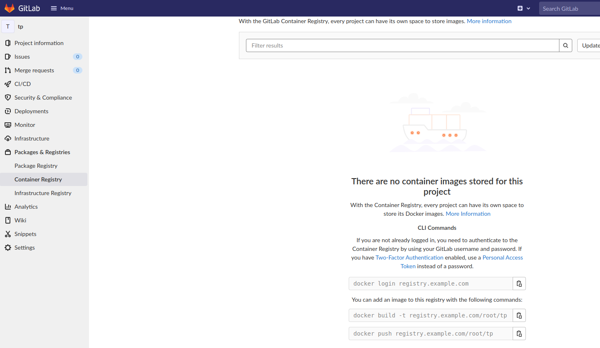
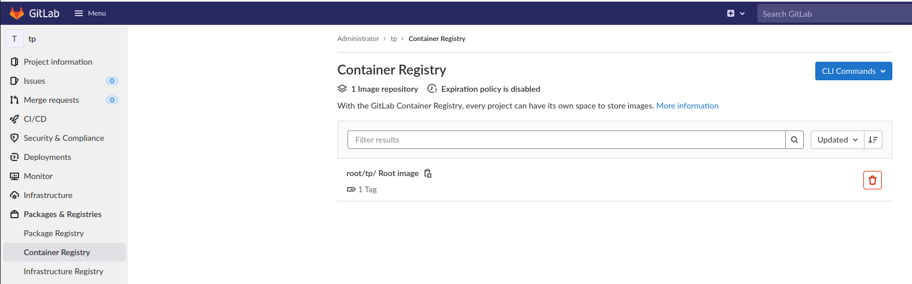

# Docker

## To Do

- Installer Docker 
- Créer un conteneur (CMS Ghost, port par défaut : 2368) 
- Créer un Dockerfile dont la commande est un `echo "Hello world"`, construire l'image & la lancer
- Activer le Registry Docker dans Gitlab via docker
- Activer le Registry Docker dans Gitlab via docker-compose
- Push votre dockerfile dans un nouveau projet gitlab
- Push votre image Docker dans le registry de votre projet Gitlab (activer le mode “insecure”)

## Solution

- Installer Docker 

Retrouvez l'info dans vos TPs Docker

- Créer un conteneur (CMS Ghost, port par défaut : 2368)

```bash
docker run -d --name ghost -e url=http://localhost:3001 -p 3001:2368 ghost

# Go to http://localhost:3001 in your browser 
```

- Créer un Dockerfile qui echo "Hello world" et construire une image

```bash
$ cd files/

$ docker build -t hello .
[+] Building 2.2s (5/5) FINISHED                                                                                                                             
 => [internal] load build definition from Dockerfile                                                                                                    0.0s
 => => transferring dockerfile: 83B                                                                                                                     0.0s
 => [internal] load .dockerignore                                                                                                                       0.0s
 => => transferring context: 2B                                                                                                                         0.0s
 => [internal] load metadata for docker.io/library/alpine:latest                                                                                        1.5s
 => [1/1] FROM docker.io/library/alpine@sha256:21a3deaa0d32a8057914f36584b5288d2e5ecc984380bc0118285c70fa8c9300                                         0.6s
 => => resolve docker.io/library/alpine@sha256:21a3deaa0d32a8057914f36584b5288d2e5ecc984380bc0118285c70fa8c9300                                         0.0s
 => => sha256:59bf1c3509f33515622619af21ed55bbe26d24913cedbca106468a5fb37a50c3 2.82MB / 2.82MB                                                          0.5s
 => => sha256:21a3deaa0d32a8057914f36584b5288d2e5ecc984380bc0118285c70fa8c9300 1.64kB / 1.64kB                                                          0.0s
 => => sha256:e7d88de73db3d3fd9b2d63aa7f447a10fd0220b7cbf39803c803f2af9ba256b3 528B / 528B                                                              0.0s
 => => sha256:c059bfaa849c4d8e4aecaeb3a10c2d9b3d85f5165c66ad3a4d937758128c4d18 1.47kB / 1.47kB                                                          0.0s
 => => extracting sha256:59bf1c3509f33515622619af21ed55bbe26d24913cedbca106468a5fb37a50c3                                                               0.1s
 => exporting to image                                                                                                                                  0.0s
 => => exporting layers                                                                                                                                 0.0s
 => => writing image sha256:28440c982c8e1855da61909218b5702616bf99bf8de3e693e7abf1c2c8b84b84                                                            0.0s
 => => naming to docker.io/library/hello                                                                                                                0.0s

$ docker run --rm hello
Hello world
```

- Activer le Registry Docker dans Gitlab via docker

https://docs.gitlab.com/ee/administration/packages/container_registry.html


```bash
$ docker exec -it gitlab bash
$ apt-get update && apt-get install -y vim
$ vim /etc/gitlab/gitlab.rb
...
################################################################################
## Container Registry settings
##! Docs: https://docs.gitlab.com/ee/administration/container_registry.html
################################################################################

registry_external_url 'http://registry.example.com'
$ gitlab-ctl reconfigure

# It will set up a registry, so the Packages & Registries will become available in the sidebar
# Take a look at /var/opt/gitlab/nginx/conf/gitlab-registry.conf to see the nginx configuration
root@gitlab:/var/opt/gitlab/nginx/conf# cat gitlab-registry.conf 
# This file is managed by gitlab-ctl. Manual changes will be
# erased! To change the contents below, edit /etc/gitlab/gitlab.rb
# and run `sudo gitlab-ctl reconfigure`.

## Lines starting with two hashes (##) are comments with information.
## Lines starting with one hash (#) are configuration parameters that can be uncommented.
##
###################################
##         configuration         ##
###################################


server {
  listen *:80;
  server_name registry.example.com;
  server_tokens off; ## Don't show the nginx version number, a security best practice

  client_max_body_size 0;
  chunked_transfer_encoding on;
...

# Update /etc/hosts
$ sudo vim /etc/hosts
127.0.0.1  localhost  my.api.video.local gitlab.example.com registry.example.com

# Configure the insecure registry - no https - in your docker daemon conf
$ cat /etc/docker/daemon.json
{
  "insecure-registries": ["registry.example.com:80"]
}
```

- Activer le Registry Docker dans Gitlab via docker-compose

```bash 
$ cd files/
$ cat docker-compose.yml
...
services:
...
    environment:
      GITLAB_OMNIBUS_CONFIG: |
        external_url 'http://gitlab.example.com'
        registry_external_url 'http://registry.example.com'
...
$ docker-compose up -d --force-recreate
```

- Push votre dockerfile dans un nouveau projet gitlab

// Créer un nouveau projet dans votre instance gitlab
// Git commit & pushez y le Dockerfile

- Push votre image Docker dans le registry de votre projet Gitlab (activer le mode “insecure”)

Suivre les instructions données dans le repo



```bash
$ docker login registry.example.com:80
Username: root
Password:
WARNING! Your password will be stored unencrypted in /home/user/.docker/config.json.
Configure a credential helper to remove this warning. See
https://docs.docker.com/engine/reference/commandline/login/#credentials-store

Login Succeeded

$ cd files
$ docker build -t registry.example.com:80/root/tp .
$ docker push registry.example.com:80/root/tp
Using default tag: latest
The push refers to repository [registry.example.com:80/root/tp]
8d3ac3489996: Pushed 
latest: digest: sha256:90c82c5dc128c43d9895d1a9382f115a60833bf52571e1aac89862e94f666986 size: 527
```


