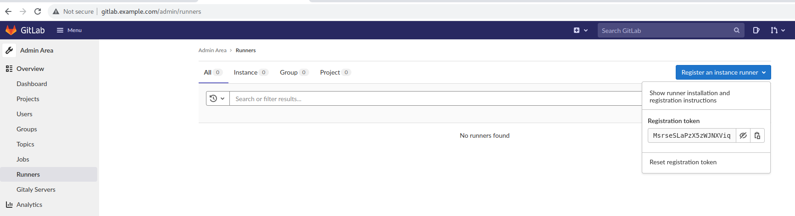
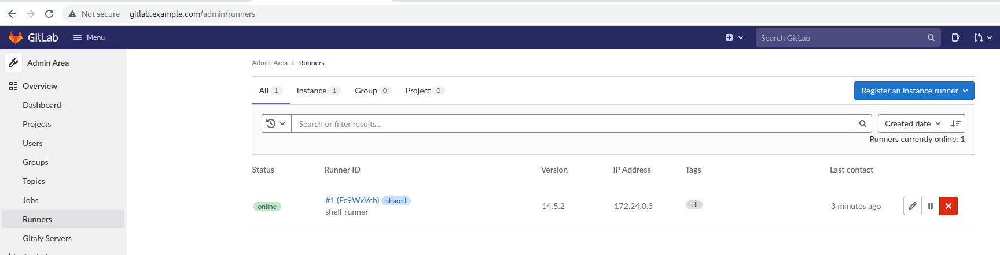
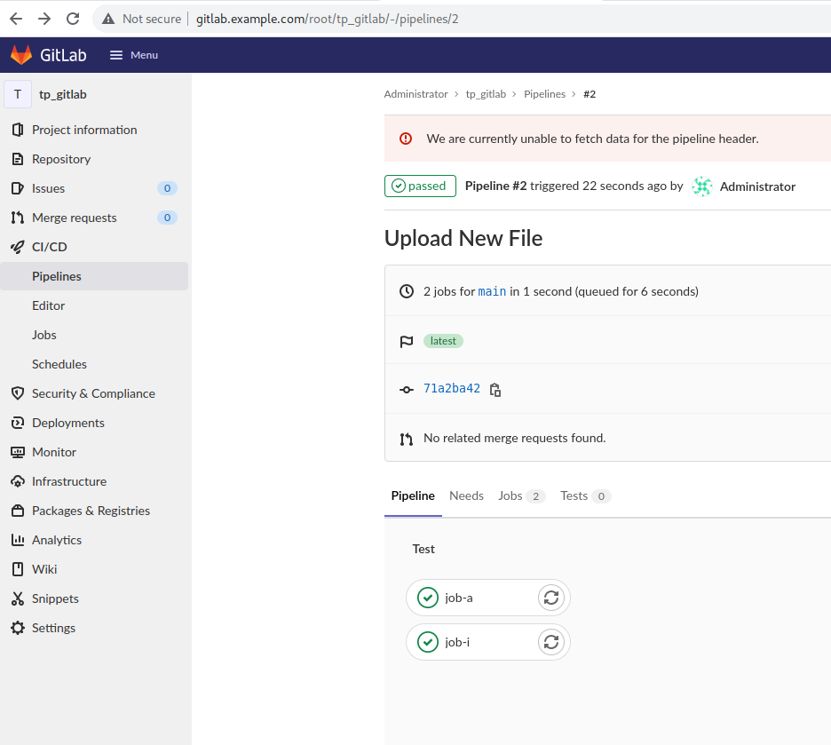

# Ma première pipeline

## To Do

- Installer un runner utilisant l’executor “shell” 
- Donner un tag “cli” au runner 
- Créer un .gitlab-ci.yml qui va juste faire un : 
echo “Mon premier job !” dans un premier job 
echo “Mon second job !” dans un second job 
- Créer un second runner utilisant l’executor “Docker” 
- Lui donner le tag “conteneur” 
- Ajouter dans le .gitlab-ci.yml ○ Un troisième job qui est dépendant des deux premiers et qui s'exécute uniquement sur Master 
○ echo “Mon job final !”

## Solution

- Installer un runner utilisant l’executor “shell” & donner un tag "cli" au runner

https://docs.gitlab.com/runner/install/index.html
https://docs.gitlab.com/runner/register/



```bash
$ cd files
$ cat docker-compose.yml
...
  gitlab-runner-shell:
    image: gitlab/gitlab-runner:alpine
    restart: unless-stopped
    container_name: shell-runner
    depends_on:
      - gitlab
    volumes:
      - '${GITLAB_HOME}/config/gitlab-runner-shell:/etc/gitlab-runner'
      - '/var/run/docker.sock:/var/run/docker.sock'
    networks:
      - gitlab
...
$ docker-compose up -d
$ docker exec -it shell-runner bash
bash-5.0# gitlab-runner register
Runtime platform                                    arch=amd64 os=linux pid=29 revision=e91107dd version=14.5.2
Running in system-mode.                            
                                                   
Enter the GitLab instance URL (for example, https://gitlab.com/):
http://gitlab.example.com
Enter the registration token:
MsrseSLaPzX5zWJNXViq
Enter a description for the runner:
[e44251207bbd]: shell-runner     
Enter tags for the runner (comma-separated):
cli
Registering runner... succeeded                     runner=MsrseSLa
Enter an executor: custom, shell, ssh, virtualbox, kubernetes, docker, docker-ssh, parallels, docker+machine, docker-ssh+machine:
shell
Runner registered successfully. Feel free to start it, but if it's running already the config should be automatically reloaded! 
```



- Créer un .gitlab-ci.yml qui va juste faire un : 
echo “Mon premier job !” dans un premier job 
echo “Mon second job !” dans un second job 

```bash
$ cd files
$ cat .gitlab-ci.yml
---
job-i:
  tags:
    - cli
  script:
    - echo "Djob i!"

job-a: 
  tags:
    - cli
  script:
    - echo "Djob a!"

$ git add .gitlab-ci.yml && git commit -m "My first djobs" && git push
```



- Créer un second runner utilisant l’executor “Docker” 

```bash
$ cd files
$ cat docker-compose.yml
...
  gitlab-runner-docker:
    image: gitlab/gitlab-runner:alpine
    restart: unless-stopped
    container_name: docker-runner
    depends_on:
      - gitlab
    volumes:
      - '${GITLAB_HOME}/config/gitlab-runner-docker:/etc/gitlab-runner'
      - '/var/run/docker.sock:/var/run/docker.sock'
    networks:
      - gitlab
$ docker-compose up -d 
$ docker exec -it docker-runner bash
bash-5.0# gitlab-runner register
Runtime platform                                    arch=amd64 os=linux pid=26 revision=e91107dd version=14.5.2
Running in system-mode.                            
                                                   
Enter the GitLab instance URL (for example, https://gitlab.com/):
http://gitlab.example.com
Enter the registration token:
MsrseSLaPzX5zWJNXViq
Enter a description for the runner:
[4e09a1612ced]: conteneur
Enter tags for the runner (comma-separated):
conteneur
Registering runner... succeeded                     runner=MsrseSLa
Enter an executor: ssh, virtualbox, shell, docker+machine, docker-ssh+machine, kubernetes, custom, docker, docker-ssh, parallels:
docker
Enter the default Docker image (for example, ruby:2.6):
alpine
Runner registered successfully. Feel free to start it, but if it's running already the config should be automatically reloaded! 
```