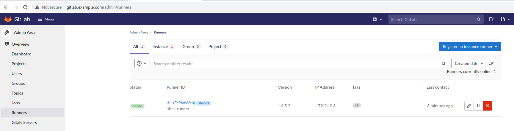
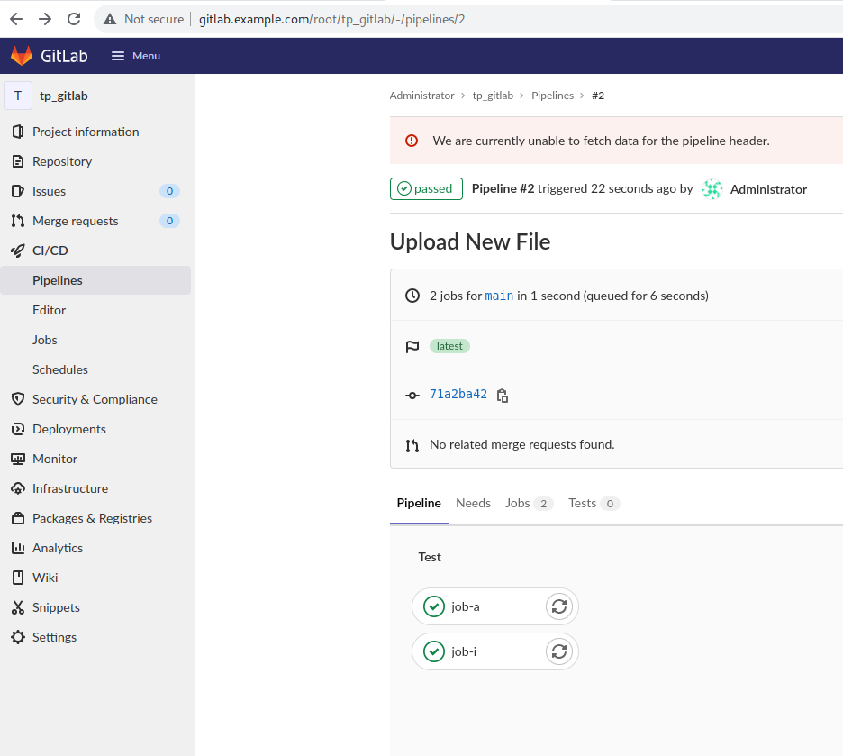

# Mon premier pipeline

## To Do

- Créer un runner dans l'interface du projet (Settings > CI/CD > Runners) et récupérer son jeton `glrt-…`
- Installer un runner utilisant l’executor “shell” et l'enregistrer avec ce jeton
- Donner un tag “cli” au runner 
- Créer un .gitlab-ci.yml qui va juste faire un :  
echo “Mon premier job !” dans un premier job  
echo “Mon second job !” dans un second job  
- Créer un second runner utilisant l’executor “Docker” 
- Lui donner le tag “conteneur” 
- Ajouter dans le .gitlab-ci.yml  
Un troisième job qui est dépendant des deux premiers et qui s'exécute uniquement sur main  
echo “Mon job final !”

The image can take a long long time to pull.  
If so, ask your teacher the .tar.gz of the docker image on USB stick. 

Reminders:
docker load < gitlab-runner-alpine_image.tar.gz
docker load < gitlab-runner-ubuntu_image.tar.gz

## Solution

- Créer le runner dans l'interface

Depuis Gitlab 16.0 un runner se crée d'abord dans l'interface, et depuis 18.0 c'est la seule façon de faire
(les *registration tokens* partagés ont été supprimés).

https://docs.gitlab.com/runner/install/  
https://docs.gitlab.com/runner/register/  
https://docs.gitlab.com/ci/runners/runners_scope/#create-a-project-runner-with-a-runner-authentication-token

Dans le projet : **Settings > CI/CD > Runners > New project runner**

- Tags : `cli`
- Cocher "Run untagged jobs" si vous voulez qu'il prenne aussi les jobs sans tag
- **Create runner** : Gitlab affiche le jeton d'authentification `glrt-…`, il n'est visible qu'une fois

Le tag et la description sont désormais définis dans l'interface, `gitlab-runner register` ne les demande plus.
Un jeton = un runner : pour le second runner (Docker) il faudra en créer un autre.

- Installer un runner utilisant l’executor “shell”

```bash
$ cd files
$ cat docker-compose.yml
...
  gitlab-runner-shell:
    image: gitlab/gitlab-runner:ubuntu
    restart: unless-stopped
    container_name: shell-runner
    depends_on:
      - gitlab
    volumes:
      - '${GITLAB_HOME}/config/gitlab-runner-shell:/etc/gitlab-runner'
      - '/var/run/docker.sock:/var/run/docker.sock'
    networks:
      - gitlab
...
$ docker compose up -d
$ docker exec -it shell-runner bash
root@e44251207bbd:/# gitlab-runner register
Runtime platform                                    arch=amd64 os=linux pid=29 revision=xxxxxxxx version=18.x.x
Running in system-mode.

Enter the GitLab instance URL (for example, https://gitlab.com/):
http://gitlab.example.com
Enter the registration token:
glrt-xxxxxxxxxxxxxxxxxxxx
Verifying runner... is valid                        runner=xxxxxxxx
Enter a name for the runner. This is stored only in the local config.toml file:
[e44251207bbd]: shell-runner
Enter an executor: custom, shell, ssh, virtualbox, kubernetes, docker, docker-windows, docker+machine, instance, parallels:
shell
Runner registered successfully. Feel free to start it, but if it's running already the config should be automatically reloaded!

# Same thing, non interactive:
root@e44251207bbd:/# gitlab-runner register --non-interactive \
    --url http://gitlab.example.com \
    --token glrt-xxxxxxxxxxxxxxxxxxxx \
    --executor shell \
    --name shell-runner

# The token ends up in /etc/gitlab-runner/config.toml
root@e44251207bbd:/# cat /etc/gitlab-runner/config.toml
```

Sur gitlab.com (formation GLN), l'URL est `https://gitlab.com` et le runner tourne sur votre poste, par exemple :

```bash
docker run -d --name shell-runner --restart unless-stopped \
  -v gitlab-runner-shell:/etc/gitlab-runner \
  gitlab/gitlab-runner:ubuntu
docker exec -it shell-runner gitlab-runner register --non-interactive \
  --url https://gitlab.com --token glrt-xxxxxxxxxxxxxxxxxxxx --executor shell --name shell-runner
```"



- Créer un .gitlab-ci.yml qui va juste faire un : 
echo “Mon premier job !” dans un premier job 
echo “Mon second job !” dans un second job 

```bash
$ cd files
$ cat .gitlab-ci.yml
---
job-i:
  tags:
    - cli
  script:
    - echo "Djob i!"

job-a: 
  tags:
    - cli
  script:
    - echo "Djob a!"

$ git add .gitlab-ci.yml && git commit -m "My first djobs" && git push
```



- Créer un second runner utilisant l’executor “Docker” 

```bash
$ cd files
$ cat docker-compose.yml
...
  gitlab-runner-docker:
    image: gitlab/gitlab-runner:ubuntu
    restart: unless-stopped
    container_name: docker-runner
    depends_on:
      - gitlab
    volumes:
      - '${GITLAB_HOME}/config/gitlab-runner-docker:/etc/gitlab-runner'
      - '/var/run/docker.sock:/var/run/docker.sock'
    networks:
      - gitlab
$ docker compose up -d 

# Create a second runner in the UI with the tag "conteneur", get its glrt- token, then:
$ docker exec -it docker-runner bash
root@4e09a1612ced:/# gitlab-runner register --non-interactive \
    --url http://gitlab.example.com \
    --token glrt-yyyyyyyyyyyyyyyyyyyy \
    --executor docker \
    --docker-image alpine \
    --name docker-runner
Runtime platform                                    arch=amd64 os=linux pid=26 revision=xxxxxxxx version=18.x.x
Running in system-mode.

Verifying runner... is valid                        runner=yyyyyyyy
Runner registered successfully. Feel free to start it, but if it's running already the config should be automatically reloaded!
```"

The job fails! Why?

```bash
Fetching changes with git depth set to 50...
Reinitialized existing Git repository in /builds/root/tp_gitlab/.git/
fatal: unable to access 'http://gitlab.example.com/root/tp_gitlab.git/': Could not resolve host: gitlab.example.com
ERROR: Job failed: exit code 1
```

https://docs.gitlab.com/runner/configuration/advanced-configuration.html#the-runnersdocker-section

```bash
$ docker network ls
NETWORK ID     NAME            DRIVER    SCOPE
f4d7bbd37566   bridge          bridge    local
56a84e4069ae   files_gitlab    bridge    local
0a464c916d24   host            host      local
ea2531c33de9   none            null      local
...

$ docker exec -it docker-runner bash
root@23fbc2cdd8f0:/# vim /etc/gitlab-runner/config.toml 
...
  [runners.docker]
    tls_verify = false
    image = "alpine"
    privileged = false
    disable_entrypoint_overwrite = false
    oom_kill_disable = false
    disable_cache = false
    volumes = ["/cache"]
    shm_size = 0
    network_mode = "files_gitlab"

# Relaunch the job
```

The same thing can be done at registration time with `--docker-network-mode files_gitlab`.

- Le troisième job, dépendant des deux premiers et uniquement sur `main`

Voir [.gitlab-ci.yml.2](./files/.gitlab-ci.yml.2) : deux stages (le second attend la fin du premier),
et une règle `rules: - if: $CI_COMMIT_BRANCH == $CI_DEFAULT_BRANCH` sur le job final.
`only` / `except` sont dépréciés au profit de `rules`.