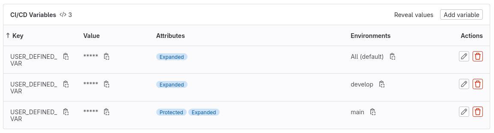

# Les environnements

## To Do

- Ajouter un nouveau job dans les tests qui va : 
  - Utiliser des environnements nommés dynamiquement en fonction du nom des branches (trouver la variables prédéfinie disponible dans Gitlab)
  - Afficher le contenu d'une variable (que vous aurez définie au niveau du projet) qui aura une valeur spécifique pour les branches **main** et **develop** et une valeur par défaut pour n'importe quelle autre branche

## Solution

- Dans votre projet allez dans "Settings" > "CI/CD" et étendez la partie correspondant aux variables.
- Définissez trois fois la même variable, une fois pour les deux environnements **main** et **develop** et une troisième pour tous les autres environnements

- Assurez-vous qu'il y a bien une branche **main** et une branche **develop** dans votre projet
- Utilisez le fichier `.gitlab-ci.yml` fourni dans le dossier `files`
- Observez que le résultat de l'affichage de la variable est différent en fonction des branches.
